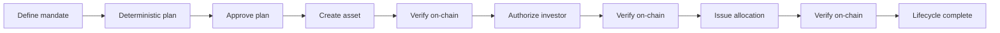
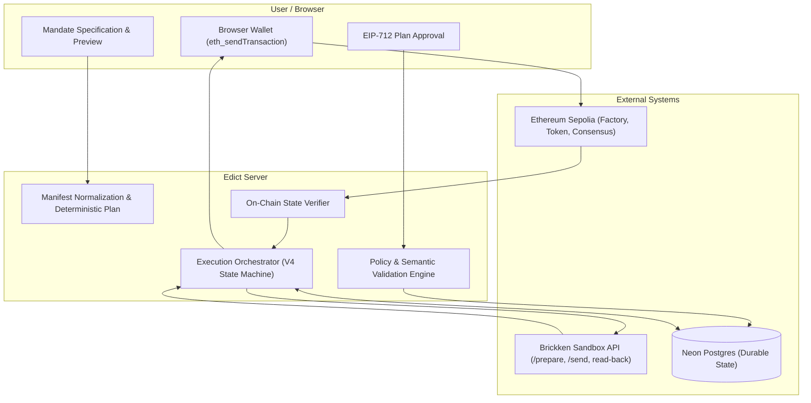

# Edict

**Tokenization, as code.**

Edict turns a declarative RWA tokenization mandate into a deterministic, human-approved execution plan, executes the lifecycle through Brickken Sandbox, and independently verifies the resulting on-chain state.

Built for the Brickken Build Programme.

Challenge classification:
**API Challenge**

Edict uses Brickken's Sandbox API directly with API-key authentication. It is not an x402/Agentic Challenge submission.

---

## What Edict does

A user defines:
- Asset name
- Token symbol
- Supply cap
- Supporting documentation URL
- Authorized signer (wallet address and email)
- Optional initial investor allocation (recipient email, address, and amount)

Edict then:
1. Normalizes the mandate into an immutable manifest
2. Builds a deterministic execution plan
3. Binds human approval to that plan
4. Creates the tokenized asset through Brickken
5. Authorizes the investor when allocation is requested
6. Mints the approved allocation
7. Waits for Ethereum finality
8. Verifies the resulting contract state
9. Produces a durable verified lifecycle record

---

## Execution lifecycle



---

## Brickken integration

Brickken Sandbox is mandatory throughout the entire execution lifecycle.

### Core methods

- `newTokenization` (`POST /prepare-transactions`): prepares the factory transaction creating the RWA token.
- `whitelist` (`POST /prepare-transactions`): prepares the investor onboarding and whitelisting transaction on the token contract.
- `mintToken` (`POST /prepare-transactions`): prepares the initial allocation minting transaction to the authorized investor.

### Core surfaces used

- **Transaction preparation**: Brickken prepares unsigned transaction calldata, gas estimates, and a tracking `txId` with `executionMode: "client-broadcast"`.
- **Transaction correlation**: `POST /send-transactions` binds `{ txId, txHash }` for Brickken indexing and backend reconciliation.
- **Transaction status**: `GET /transaction-status` provides secondary upstream status tracking.
- **Secondary read-back**: `GET /get-token-info`, `GET /get-tokenizer-info`, `GET /get-whitelist-status`, and `GET /get-balance-and-whitelist` corroborate on-chain state.

### Execution model

1. **Brickken Sandbox prepares the operation** with server-side API authentication.
2. **Edict validates the prepared payload** against the approved mandate (destination, selector, calldata hash, signer, and fee caps).
3. **The connected wallet confirms each operation** in browser (`eth_sendTransaction`).
4. **Ethereum Sepolia executes the transaction**.
5. **Edict correlates the broadcast** with Brickken via `POST /send-transactions`.
6. **Edict verifies finalized on-chain state** upon Ethereum consensus finality.

### Deployment boundaries

- **Sandbox only**: uses `https://api.sandbox.brickken.com` exclusively.
- **Ethereum Sepolia**: chain ID `11155111` (`0xaa36a7`).
- **No production Brickken API usage**.
- **API key is server-only**: never exposed to client bundles or browser storage.
- **Zero private-key custody**: private keys and seed phrases never enter Edict.

---

## Architecture and trust boundaries



---

## Execution safety

- **Deterministic manifest and plan hashes**: canonical SHA-256 hashes (`manifestHash`, `planHash`) bind input to execution.
- **Explicit human plan approval**: requires an EIP-712 signature from the designated tokenizer wallet before any transaction can be prepared.
- **Exact required signer enforcement**: only the designated wallet address can approve or execute mandate operations.
- **Ethereum Sepolia enforcement**: chain ID `11155111` is enforced across the server, wallet, and RPC layers.
- **Brickken-prepared transaction validation**: destination address, function selector, and calldata are verified against server policy before wallet presentation.
- **Bounded server-owned fee policy**: Edict enforces strict EIP-1559 priority fee and gas limits; excessive wallet fees trigger policy alerts.
- **Zero private-key custody**: signing occurs exclusively in the user's browser wallet.
- **Per-operation submission boundary**: wallet confirmation is required for each on-chain operation; Edict automatically handles preparation, tracking, reconciliation, and verification around those confirmations, ensuring exactly one `eth_sendTransaction` invocation per approved step.
- **No automatic resend**: ambiguous submissions fail closed to prevent accidental double-broadcasts.
- **Durable compare-and-swap transitions**: optimistic revision locking on Postgres prevents race conditions.
- **Ethereum finalized-state verification**: read-back evaluation occurs after Ethereum consensus finality.
- **Derivation integrity**: downstream `WHITELIST` and `MINT` operations dynamically target the verified token address derived from `TOKENIZE`.
- **Server-side secrets**: API keys, signing secrets, and database credentials remain strictly within server boundaries.

---

## Verification model

Brickken remains mandatory for preparation and lifecycle integration. After execution, Edict relies on authoritative finalized Ethereum state to verify the requested outcome, ensuring progression does not stall on secondary indexing delays.

- **TOKENIZE verification**:
  - Finalized successful receipt on Ethereum Sepolia
  - Reviewed Brickken Factory proxy (`0x23B04b6410D72Fa66A77a9e0146DF6634Ad4C462`)
  - ERC-1967 storage slot implementation verification at the receipt block
  - Canonical `NewTokenization` event extraction (`tokenAddress`, `escrowAddress`, `tokenizationId`)
  - Direct token contract bytecode and `decimals()` verification
- **WHITELIST verification**:
  - Finalized successful transaction receipt
  - Direct on-chain role verification (`hasRole(WHITELISTED_ROLE, investor)` or `RoleGranted` event)
- **MINT verification**:
  - Finalized successful transaction receipt
  - Direct on-chain balance verification (`balanceOf(investor) >= expectedRaw`)

Brickken read endpoints provide secondary corroboration with a bounded timeout; delayed off-chain indexing does not block UI progression when authoritative on-chain state is verified. Genuine data contradictions fail closed.

---

## Verified Sandbox execution

Live full-lifecycle run verified on Ethereum Sepolia (Chain ID `11155111`):

| Parameter | Value |
| --- | --- |
| **Network** | Ethereum Sepolia (Chain ID `11155111`) |
| **Token Contract** | [`0xc65145124d0b25dfa32e4b0385bd9b953045f50e`](https://sepolia.etherscan.io/address/0xc65145124d0b25dfa32e4b0385bd9b953045f50e) |
| **Tokenization ID** | `597` |
| **Investor** | `0x5c53414e1f15d7668c2b9ec0a92482a64845f5f6` |
| **Allocation** | `100 DPI` |
| **TOKENIZE Transaction** | [`0xbb76a942d3d30edd5b441764d9489a2def122bbf6f6e7dc67526dd1591ad3a0b`](https://sepolia.etherscan.io/tx/0xbb76a942d3d30edd5b441764d9489a2def122bbf6f6e7dc67526dd1591ad3a0b) |
| **WHITELIST Transaction** | [`0x15c9a373a3e6381d2a050924b420001c8d3a3523d294770aea8ae68b855ca84c`](https://sepolia.etherscan.io/tx/0x15c9a373a3e6381d2a050924b420001c8d3a3523d294770aea8ae68b855ca84c) |
| **MINT Transaction** | [`0x73ca036ffaaaf7749030831c925d597a268098679632c9e849bd0108f4845797`](https://sepolia.etherscan.io/tx/0x73ca036ffaaaf7749030831c925d597a268098679632c9e849bd0108f4845797) |
| **Lifecycle Status** | `SUCCEEDED` (All operations `READ_BACK_VERIFIED`) |

---

## Quick start

### Prerequisites

- Node.js 24 LTS (see `.nvmrc` and `package.json`)
- npm
- Brickken Sandbox API key
- Ethereum Sepolia RPC URL
- Neon Postgres database
- Browser wallet with Sepolia ETH

### Installation

```sh
npm ci
```

### Configuration

Copy the example configuration:

```sh
cp .env.example .env.local
```

Configure required variables in `.env.local`:

- `BRICKKEN_API_KEY`: Server-only Brickken sandbox API key.
- `BRICKKEN_TOKENIZER_EMAIL`: Licensed Brickken sandbox account email.
- `DATABASE_URL`: Neon Postgres connection string (`postgresql://...`).
- `EDICT_RUN_SECURITY_SECRET`: 32+ byte unpadded base64url secret for capability signing.
- `EDICT_RUN_API_ENABLED`: Set to `1`.
- `EDICT_TRUSTED_ORIGIN`: Exact application origin (e.g. `http://localhost:3000`).
- `EDICT_TRANSACTION_PREPARATION_ENABLED`: Set to `1`.
- `EDICT_TOKENIZE_EXECUTION_ENABLED`: Set to `1`.
- `EDICT_TOKENIZE_ALLOWED_DESTINATION`: Reviewed factory address (`0x23B04b6410D72Fa66A77a9e0146DF6634Ad4C462`).
- `EDICT_TOKENIZE_FUNCTION_SIGNATURE`: Canonical reviewed `newTokenization` function signature.
- `EDICT_SEPOLIA_RPC_URL`: HTTPS JSON-RPC endpoint for Sepolia.

### Database setup

Apply committed database migrations:

```sh
npm run db:migrate
```

### Run

```sh
npm run dev
```

---

## Testing

```sh
npm test              # Run unit and architectural tests with Vitest
npm run typecheck     # Strict TypeScript compiler verification (tsc --noEmit)
npm run lint          # Run ESLint across the codebase
npm run build         # Next.js production build verification
```

### Additional verification

```sh
npm run test:brickken-live-read     # Opt-in live Brickken sandbox connectivity check
npm run test:database-live          # Opt-in live Neon Postgres CAS verification
npm run test:phase8                 # Offline adversarial boundary harness tests
npm run audit:phase8-client-bundle  # Client-bundle boundary audit
```

---

## Project structure

```text
src/
  app/          Next.js App Router routes and API endpoints
  components/   Product UI and execution lifecycle components
  core/         Deterministic domain logic, normalization, hashing, and plan generation
  server/       Brickken adapter, Neon persistence, orchestration, and RPC verification
  shared/       Shared validation schemas and execution contracts
drizzle/        Drizzle SQL migrations
tools/          Verification, preflight, and security harness
docs/           Technical specifications and architectural audits
```

---

## Limitations and scope

- **Brickken Sandbox only**: designed for the Brickken Sandbox environment; not configured for production mainnet deployment.
- **Ethereum Sepolia**: targeted exclusively to Ethereum Sepolia for this submission.
- **Single investor allocation**: supports one optional initial investor allocation per mandate.
- **Human wallet confirmations required**: wallet confirmation is required for each on-chain operation; Edict automatically handles preparation, tracking, reconciliation, and verification around those confirmations. Edict never submits wallet transactions without explicit user confirmation.
- **Zero custody**: Edict does not manage, hold, or escrow private keys.

---

## AI-assisted development

Edict was built with AI-assisted development using tools and models from:
- Google
- xAI

AI was used for implementation assistance, code review, debugging, testing, and UI iteration. Product direction, architecture decisions, Brickken integration decisions, live wallet validation, transaction execution, failure triage, and final review were human-directed.

---

## Documentation

- [`docs/CORE_DOMAIN_SPEC.md`](docs/CORE_DOMAIN_SPEC.md): Canonical asset manifest, normalization rules, SHA-256 identity derivations, and deterministic execution plan specification.

---

## License

Licensed under the Apache License 2.0. See [LICENSE](./LICENSE).
